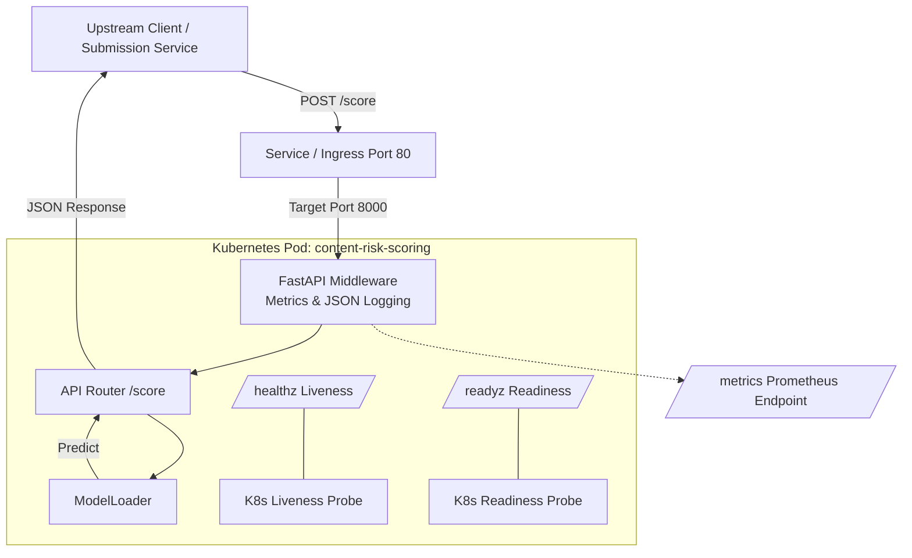

# Real-Time Content Risk Scoring System

[](https://www.python.org/downloads/release/python-3110/)
[](https://fastapi.tiangolo.com/)
[](https://www.docker.com/)
[](https://kubernetes.io/)
[](https://prometheus.io/)
[](.github/workflows/ci.yml)

A production-grade, synchronous HTTP text risk-scoring service built with **FastAPI**, **Docker**, and **Kubernetes**. Designed under strict latency constraints (p95 < 50ms), this service assigns probabilistic risk scores to user-submitted text content while prioritizing **reliability, observability, predictable latency, and graceful degradation** over model complexity.

---

## 📌 Table of Contents

- [Overview & Philosophy](#-overview--philosophy)
- [Architecture & Data Flow](#-architecture--data-flow)
- [Key Features & Guarantees](#-key-features--guarantees)
- [Repository Structure](#-repository-structure)
- [API Specification](#-api-specification)
- [Failure Handling & Resiliency](#-failure-handling--resiliency)
- [Getting Started](#-getting-started)
  - [Prerequisites](#prerequisites)
  - [Local Development](#local-development)
  - [Running with Docker](#running-with-docker)
  - [Deploying to Kubernetes](#deploying-to-kubernetes)
  - [Running Tests](#running-tests)
- [Design Decisions & Architecture Documents](#-design-decisions--architecture-documents)
- [Scope & Non-Goals](#-scope--non-goals)

---

## 💡 Overview & Philosophy

Content risk systems serve as critical front-line infrastructure for web platforms. Unpredictable latency, hidden failures, or unvalidated deployments can cause platform-wide disruption or silent misclassification.

This service is engineered with a **safety-first operational design**:
1. **Reliability over Complexity**: Stateless inference with versioned, offline-trained model artifacts.
2. **Explicit Failure Boundaries**: Unhealthy models are prevented from accepting traffic via Kubernetes readiness probes.
3. **Graceful Fallback**: Runtime errors degrade responses into an `UNKNOWN` risk category rather than failing with `HTTP 500`.
4. **Full Observability**: Structured JSON logging and Prometheus metric collection instrumented at the middleware layer.

---

## 🏗 Architecture & Data Flow



---

## ✨ Key Features & Guarantees

- **Stateless HTTP API**: Synchronous REST API powered by FastAPI & Pydantic with explicit input contract boundaries (1–5000 characters).
- **Hardened Containerization**: Multi-stage Docker build producing a lightweight runtime running under a non-root `appuser`.
- **Kubernetes Ready**: Complete k8s manifests featuring strict resource requests/limits (`200m`-`500m` CPU, `512Mi`-`1Gi` RAM) and dedicated `/healthz` and `/readyz` probes.
- **Production Observability**: Standardized JSON logs (`StreamHandler`) and Prometheus latency histograms (`http_request_latency_seconds`) & HTTP counter metrics (`http_requests_total`).
- **Gated CI/CD**: GitHub Actions workflow validating dependencies, running unit tests, and verifying Docker container builds.

---

## 📁 Repository Structure

```directory
Risk_Scoring_System/
├── app/                      # Application core source code
│   ├── api/
│   │   └── score.py          # /score endpoint handler with try/except fallback
│   ├── core/
│   │   ├── config.py         # App configuration settings
│   │   ├── logging.py        # Structured JSON formatter setup
│   │   └── metrics.py        # Prometheus counters and histograms
│   ├── models/
│   │   └── loader.py         # Immutable ModelLoader and prediction interface
│   ├── schemas/
│   │   └── score.py          # Pydantic schemas for request & response validation
│   ├── health.py             # Liveness (/healthz) & readiness (/readyz) routers
│   ├── main.py               # FastAPI initialization & route mounting
│   └── middleware.py         # HTTP latency timing & metrics collection
├── design/                   # Architectural & technical design documentation
│   ├── INTERVIEW_MAP.md      # Navigation index for technical interview review
│   ├── architecture-decisions.md
│   ├── ci-cd-decisions.md
│   ├── inference-service-decisions.md
│   ├── kubernetes-decisions.md
│   ├── ml-pipeline-decisions.md
│   ├── project-scope.md
│   ├── risk-and-failure-analysis.md
│   ├── system-boundaries.md
│   └── what-i-would-change.md
├── k8s/                      # Kubernetes deployment manifests
│   ├── namespace.yaml        # content-risk-staging namespace declaration
│   ├── deployment.yaml       # Replica, container resources, and health probes
│   └── service.yaml          # ClusterIP service exposed on port 80
├── tests/                    # Test suite
│   └── test_health.py        # System health & API unit tests
├── .github/workflows/
│   └── ci.yml                # GitHub Actions CI pipeline
├── Dockerfile                # Multi-stage container build definition
├── requirements.txt          # Python runtime dependencies
└── README.md                 # Project documentation
```

---

## 🔌 API Specification

### 1. Score Content

Evaluates submitted text content and returns a probabilistic risk score and classification label.

- **Endpoint**: `POST /score`
- **Content-Type**: `application/json`

#### Request Body
```json
{
  "content": "Text content to be evaluated for risk."
}
```
*Constraints*: `content` string length must be between 1 and 5000 characters.

#### Response (Success - 200 OK)
```json
{
  "risk_score": 0.1,
  "risk_label": "LOW",
  "model_version": "baseline-0.0.1"
}
```

#### Response (Degraded Fallback - 200 OK)
If an internal error occurs during model execution, the service returns a safe degraded response instead of throwing a `500 Internal Server Error`:
```json
{
  "risk_score": 0.5,
  "risk_label": "UNKNOWN",
  "model_version": "baseline-0.0.1"
}
```

---

### 2. Health & Readiness Probes

- **Liveness Probe**: `GET /healthz`
  - Returns `{"status": "ok"}` (HTTP 200) when the process is running.
- **Readiness Probe**: `GET /readyz`
  - Returns `{"ready": true}` (HTTP 200) once model loading is complete.

### 3. Prometheus Metrics

- **Endpoint**: `GET /metrics`
  - Exposes standard ASGI and custom Prometheus metrics including `http_requests_total` and `http_request_latency_seconds`.

---

## 🛡 Failure Handling & Resiliency

| Failure Scenario | System Behavior & Mitigation |
| :--- | :--- |
| **Model Artifact Load Failure** | `ModelLoader.load()` throws a `RuntimeError` during process startup. The readiness probe (`/readyz`) fails, causing Kubernetes to route traffic away from the pod. |
| **Runtime Inference Error** | Exception caught in `app/api/score.py`. Returns a degraded payload (`risk_score: 0.5`, `risk_label: "UNKNOWN"`) and logs an error without crashing the process. |
| **Pod / Process Crash** | Kubernetes Liveness Probe (`/healthz`) detects non-responsiveness and automatically restarts the container pod. |
| **Simulated Initialization Error** | Pass environment variable `FAIL_MODEL_LOAD=true` to test readiness probe rejection during startup. |

---

## 🚀 Getting Started

### Prerequisites

- **Python**: 3.11+
- **Docker**: 20.10+ (optional, for containerization)
- **Kubectl & Kubernetes Cluster**: (optional, for cluster deployment)

### Local Development

1. **Clone the repository**:
   ```bash
   git clone https://github.com/Karthik0000007/Risk_Scoring_System.git
   cd Risk_Scoring_System
   ```

2. **Create and activate a virtual environment**:
   ```bash
   python -m venv venv
   # On Linux/macOS:
   source venv/bin/activate
   # On Windows PowerShell:
   .\venv\Scripts\Activate.ps1
   ```

3. **Install dependencies**:
   ```bash
   pip install -r requirements.txt
   ```

4. **Start the Uvicorn dev server**:
   ```bash
   uvicorn app.main:app --reload --host 0.0.0.0 --port 8000
   ```

5. **Test the endpoint**:
   ```bash
   curl -X POST "http://localhost:8000/score" \
        -H "Content-Type: application/json" \
        -d '{"content": "This is a sample text request for risk evaluation."}'
   ```

---

### Running with Docker

1. **Build the container image**:
   ```bash
   docker build -t content-risk-scoring:latest .
   ```

2. **Run the container**:
   ```bash
   docker run -d -p 8000:8000 --name risk-service content-risk-scoring:latest
   ```

3. **Check container logs**:
   ```bash
   docker logs -f risk-service
   ```

---

### Deploying to Kubernetes

1. **Create the namespace**:
   ```bash
   kubectl apply -f k8s/namespace.yaml
   ```

2. **Deploy the service and deployment manifests**:
   ```bash
   kubectl apply -f k8s/service.yaml
   kubectl apply -f k8s/deployment.yaml
   ```

3. **Verify pod and service status**:
   ```bash
   kubectl get pods -n content-risk-staging
   kubectl get svc -n content-risk-staging
   ```

---

### Running Tests

Run the test suite using `pytest`:

```bash
pytest
```

---

## 📚 Design Decisions & Architecture Documents

The project includes formal architecture decision records (ADRs) and design notes inside the [`design/`](design/) directory:

- [**Interview Map**](design/INTERVIEW_MAP.md): High-level navigation guide connecting technical requirements to design docs.
- [**Architecture Decisions**](design/architecture-decisions.md): Selection of a single stateless HTTP service over microservices/event-driven options.
- [**Inference Service Decisions**](design/inference-service-decisions.md): Rationale behind REST vs. gRPC and synchronous latency boundaries.
- [**Kubernetes Decisions**](design/kubernetes-decisions.md): Pod deployment specifications, probe definitions, and resource limits.
- [**ML Pipeline Decisions**](design/ml-pipeline-decisions.md): Offline batch training, versioning, and serving separation.
- [**CI/CD Decisions**](design/ci-cd-decisions.md): Gated automated pipelines and manual production promotion strategies.
- [**Risk and Failure Analysis**](design/risk-and-failure-analysis.md): Threat matrix and fallback behavior specs.
- [**System Boundaries**](design/system-boundaries.md): Defined scope of ownership vs external dependencies.
- [**Project Scope**](design/project-scope.md): In-scope features and explicit non-goals.
- [**What I Would Change**](design/what-i-would-change.md): Future expansion roadmap (canary deployments, autoscaling, multi-region).

---

## 🚫 Scope & Non-Goals

To maintain clear operational boundaries and focus on service reliability, the following features are **explicitly out of scope**:

- ❌ **Multimedia Processing**: Text content scoring only; no images, video, or audio.
- ❌ **Automated Enforcement**: System computes risk scores only; downstream policy engines execute blocks/bans.
- ❌ **Online Learning**: No real-time weights updates; all model training is conducted offline.
- ❌ **SOTA NLP Overhead**: Priority is given to sub-50ms execution and low resource footprint over large language models.
